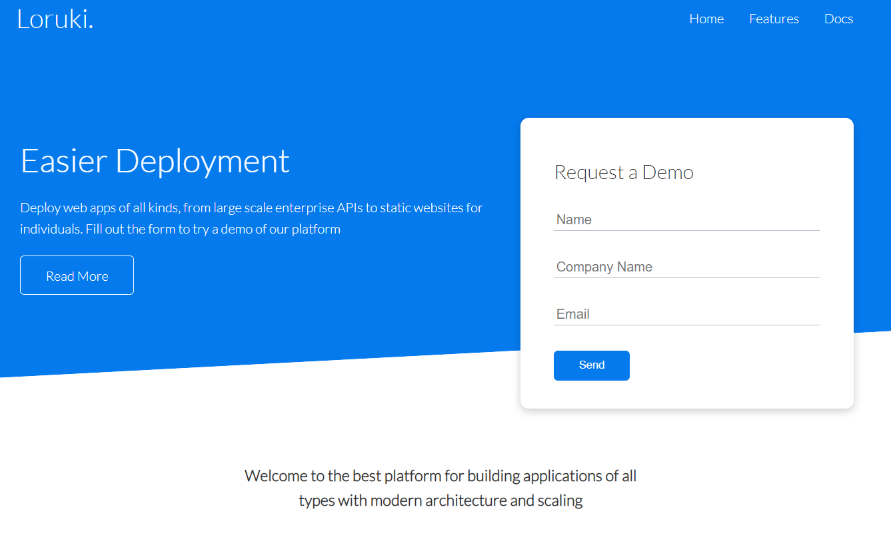
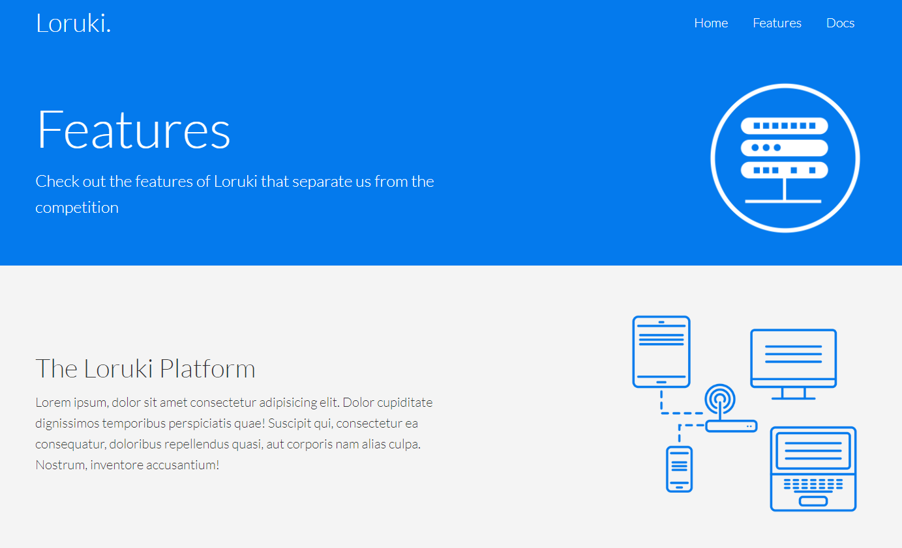
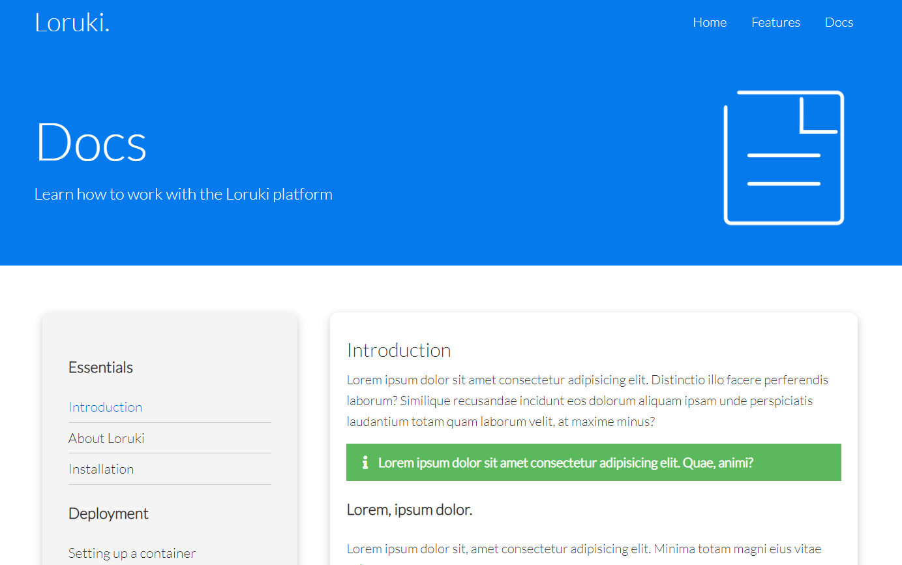

# Loruki rebuild

> Loruki is a cloud hosting platform which allows user to deploy their projects
> easily. We are trying to rebuild this web site with HTML and CSS.

Visit our loruki page : [Loruki rebuil](deployed link to be added)

## Table of contents

- [Loruki rebuild](#loruki-rebuild)
  - [Table of contents](#table-of-contents)
  - [General info](#general-info)
  - [Screenshots](#screenshots)
  - [Technologies](#technologies)
  - [Features](#features)
  - [Status](#status)
  - [Inspiration](#inspiration)
  - [Contributors](#contributors)

## General info

> Loruki is a hosting platform project which contains homepage, features page
> and docs page. This platform supports multiple languages such as: Node.js,
> Python, C#, Ruby, PHP, Scala and Clojure...etc.

## Screenshots

- Homepage 

- Features 

- Docs 

## Technologies

- Node 14.16.0
- VSC code
- HTML
- CSS
- NPM
- Browser [Microsoft Edge, Google Chrome]

## Features

List of features ready and Todos for future development.

- The actual figures of `total numbers of deployments`,
  `total capacity of published projects` and `total numbers of hosted projects`.
- A form to let user to request a demo for loruki website.
- Precisely explained documentation which includes the subjects about
  `Installation`, `Deployment`, `Setting up a container`, `Using the CLI`,
  `Managing resources` and `Upgrade & downgrade`.

To-do list:

- Add more supported languages.
- Add a contact page with developer and client service's contact information,
  which will allow the user to report bugs or to send feedback easier.

## Status

Project is: _in progress_

## Inspiration

Project by freeCodeCamp.org

## Contributors

- [Mervat](https://github.com/Mervatabuamro)
- [Juan](https://github.com/jialvaradob)
- [Hsia](https://github.com/yunhsiaho)
